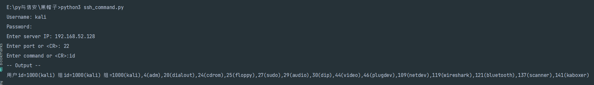
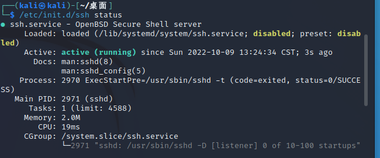

# 运行ssh_command.py

`python3 ssh_command.py`

依次输入即可：



我这里是用win11连接kali的ssh。


需要注意的点就是kali的ssh服务要开启，这样才能连接到它的ssh。

## 如何开启kali的ssh

1. kali输入`/etc/init.d/ssh status`,可以查看ssh目前状况，如果不是如下样貌的则需要按照接下来的步骤开启ssh。




2. `vim /etc/ssh/sshd_config` ,修改ssh配置文件

   下面两处要进行相应的修改：

   

   ```
   #PermitRootLogin prohibit-password
   |
   |
   v
   
   PermitRootLogin yes
   
   
   #PasswordAuthentication yes
   |
   |
   v
   PasswordAuthentication yes
   ```

   

   

​	3. `/etc/init.d/ssh start`  启动ssh


然后就可以愉快地用windows连接kali的ssh了。